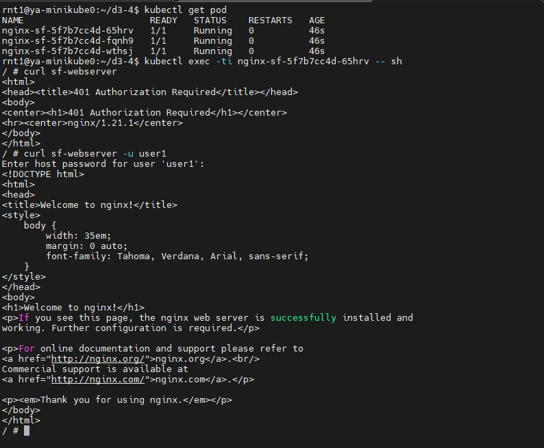

# Практикум D3.4

1. Создал сущность Deployment с заданными свойствами (см. deployment.yaml)

2. Создал конфигурационный файл с заданными свойствами (см. configmap.yaml)

3. Создал сущность Service для того, чтобы можно было обращаться к любому из Pod’ов по единому имени (см. service.yaml)

4. Создал секрет со заданными параметрами (см. secret.yaml)

5. Подлкючил секрет к контейнерам (см. deployment.yaml)

6. Проверка показала, что доступ к странице по умолчанию возможен после авторизации.

> Скриншот созданных подов и результат проверки:
